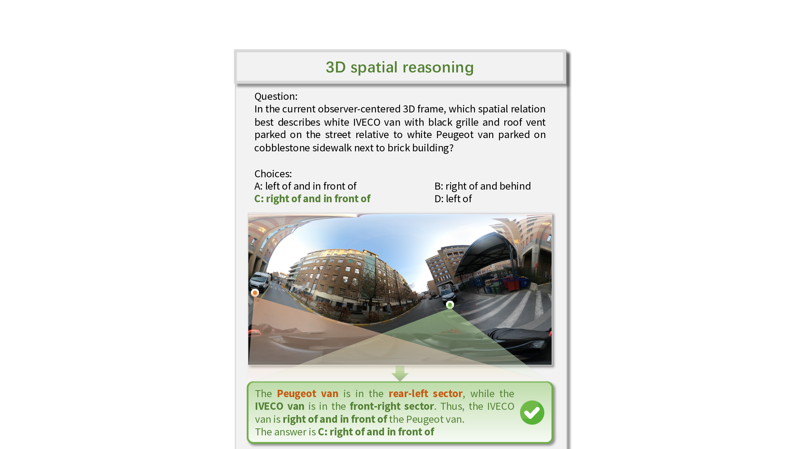
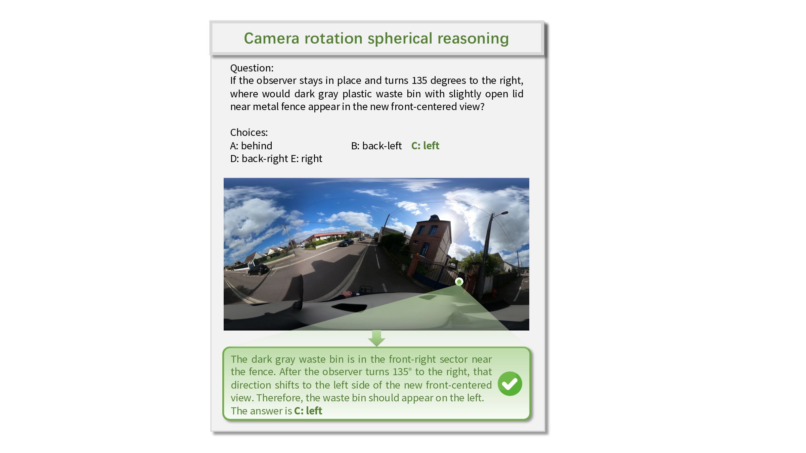
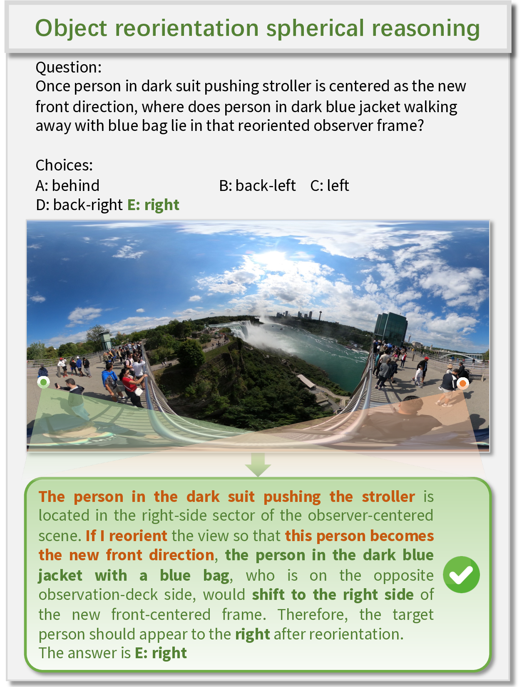
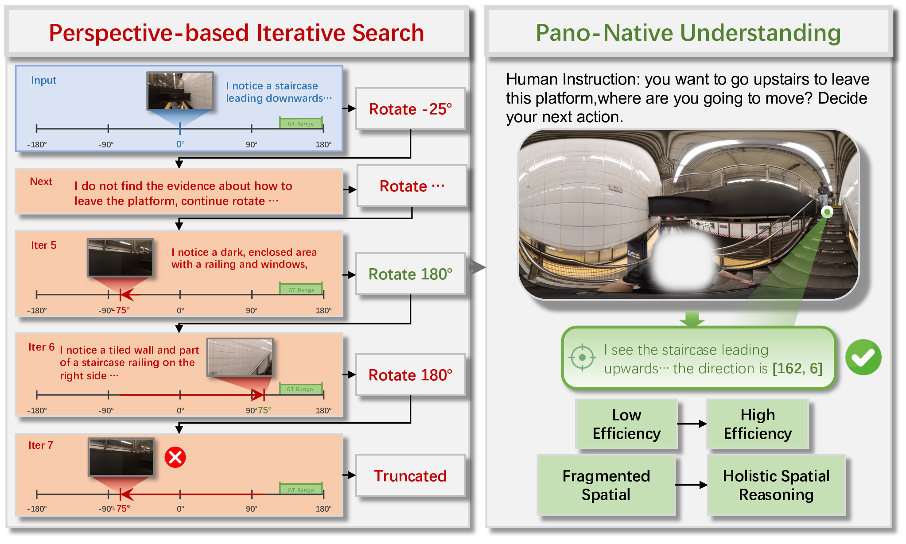
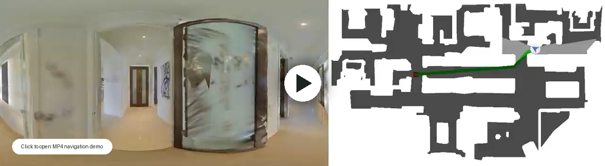

<div align="center">

# PanoWorld: Towards Spatial Supersensing in 360° Panorama World

**Pano-native multimodal learning for full-surround 360° spatial reasoning, holistic sensing, and panoramic navigation.**

[](https://wcpcp.github.io/PanoWorld/)
[](https://arxiv.org/pdf/2605.13169)
[](https://huggingface.co/papers/2605.13169)
[](#release-todo)
[](#release-todo)

</div>

<p align="center">
  
</p>

## What Is PanoWorld?

Existing MLLMs often reason over fragmented perspective crops, making it difficult to associate spatial cues across the full 360° field of view. **PanoWorld** introduces **pano-native supersensing**, where VLMs perceive and reason directly over complete equirectangular panorama (ERP) observations as continuous observer-centered worlds.

This enables a unified full-surround representation for downstream tasks such as human-centric visual search, omnidirectional 3D spatial reasoning, and panoramic navigation.

## Highlights

| Component | Description |
| --- | --- |
| 🌐 **Pano-native supersensing** | Learns from complete 360° ERP panoramas instead of stitching together narrow perspective views. |
| 🧠 **PanoSpace-Bench** | Diagnostic benchmark for ERP-native spatial localization, 3D relations, BFOV grounding, and reorientation. |
| 🏗️ **PanoWorld** | Injects spherical geometry into the visual stream through Spherical Spatial Cross-Attention. |
| 🚶 **Embodied transfer** | Transfers panoramic understanding to navigation settings such as R2R-CE Val-Unseen. |

## Release TODO

We are preparing the public release. Code, checkpoints, datasets, and benchmark files will be uploaded in stages.

- [x] 📄 Paper
- [ ] 📦 Code
- [ ] 🗂️ Dataset
- [ ] 🧪 Benchmark
- [ ] 🧠 Checkpoints

## Visual Examples

<p align="center">
  
  
  
</p>

<p align="center">
  <em>PanoSpace-Bench examples cover 3D relation reasoning, reference-frame transformation, and object reorientation in full 360° ERP panoramas.</em>
</p>

<p align="center">
  
</p>

<p align="center">
  <em>H*Bench examples show how pano-native reasoning avoids fragmented perspective-view search and supports holistic object and position sensing.</em>
</p>

<p align="center">
  <a href="./docs/assets/demo_vln1.mp4">
    
  </a>
</p>

<p align="center">
  <em>Navigation transfer example: full-surround ERP observations expose global layout cues and reduce blind spots compared with narrow RGB perspective-view navigation. Click the preview to open the MP4 demo.</em>
</p>

## News

- **2026-05**: Project page, arXiv PDF, and Hugging Face paper page are available.
- **Coming soon**: Code, checkpoints, dataset, and benchmark release.

## Citation

If you find PanoWorld useful for your research, please cite:

```bibtex
@article{panoworld2026,
  title   = {PanoWorld: Towards Spatial Supersensing in 360° Panorama World},
  author  = {Wang, Changpeng and Lin, Xin and Liu, Junhan and Liu, Yuheng and Wang, Zhen and Qi, Donglian and Yan, Yunfeng and Chen, Xi},
  journal = {arXiv preprint arXiv:2605.13169},
  year    = {2026}
}
```

## Contact

For questions about the project, please open an issue or contact the authors listed in the paper.
