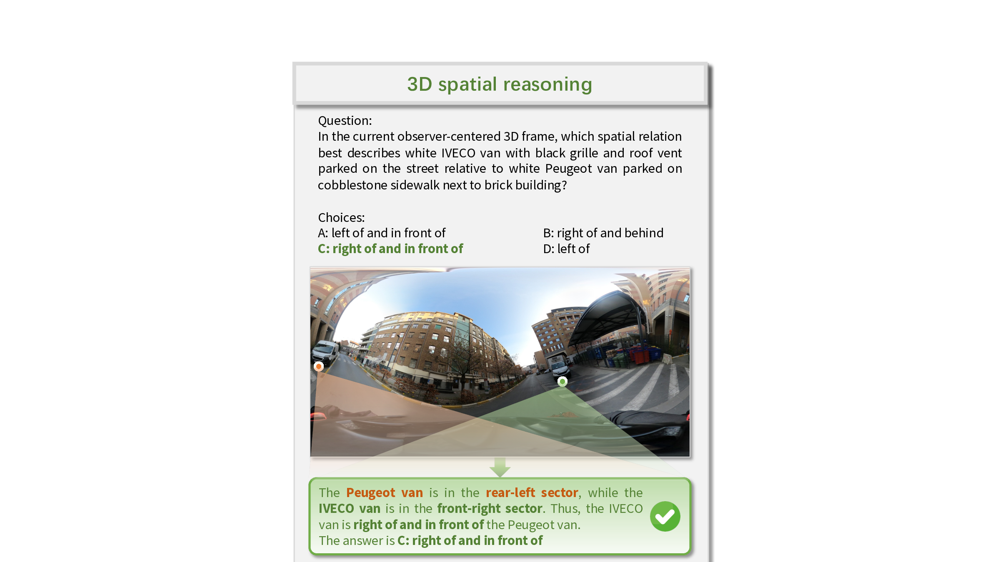
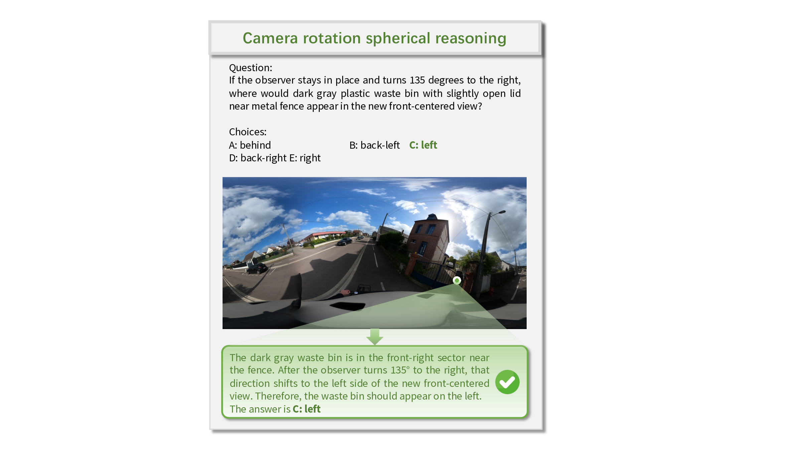
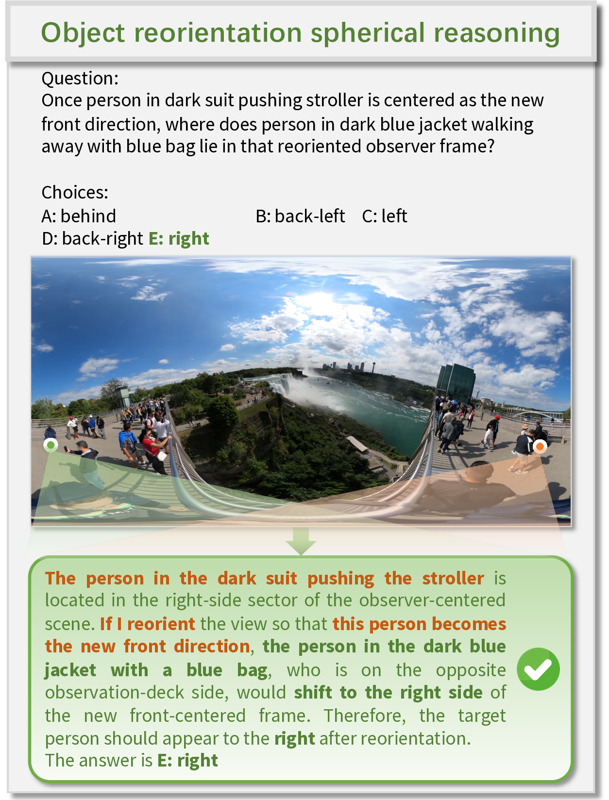
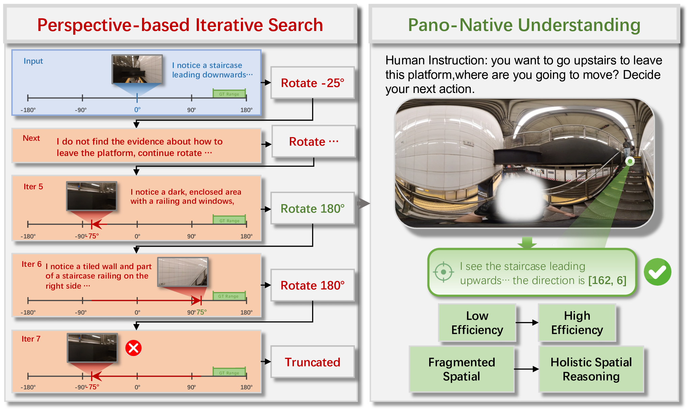
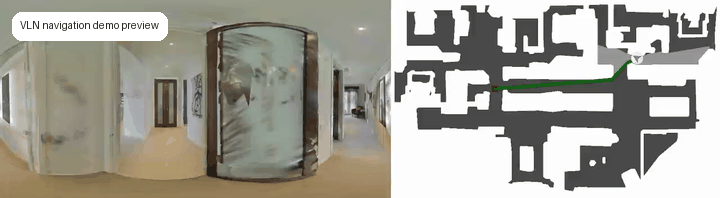

<div align="center">

# PanoWorld: Towards Spatial Supersensing in 360° Panorama World

<p>
Changpeng Wang<sup>1</sup>, Xin Lin<sup>2</sup>, Junhan Liu<sup>1</sup>, Yuheng Liu<sup>3</sup>, Zhen Wang<sup>1</sup>, Donglian Qi<sup>1</sup>, Yunfeng Yan<sup>1</sup>, Xi Chen<sup>4</sup>
</p>

<p>
<sup>1</sup>Zhejiang University &nbsp;&nbsp;
<sup>2</sup>University of California San Diego &nbsp;&nbsp;
<sup>3</sup>University of California Irvine &nbsp;&nbsp;
<sup>4</sup>The University of Hong Kong
</p>

[](https://wcpcp.github.io/PanoWorld/)
[](https://arxiv.org/pdf/2605.13169)
[](https://huggingface.co/papers/2605.13169)
[](https://huggingface.co/wcccp/PanoWorld)
[](https://huggingface.co/datasets/wcccp/Pano_dataset)
[](https://huggingface.co/datasets/wcccp/PanoSpace-Bench)

</div>

<p align="center">
  
</p>

## What Is PanoWorld?

Existing MLLMs often reason over fragmented perspective crops, making it difficult to associate spatial cues across the full 360° field of view. **PanoWorld** introduces **pano-native supersensing**, where VLMs perceive and reason directly over complete equirectangular panorama (ERP) observations as continuous observer-centered worlds.

This enables a unified full-surround representation for downstream tasks such as human-centric visual search, omnidirectional 3D spatial reasoning, and panoramic navigation.

## Highlights

| Component | Description |
| --- | --- |
| 🌐 **Pano-native supersensing** | Learns from complete 360° ERP panoramas instead of stitching together narrow perspective views. |
| 🧠 **PanoSpace-Bench** | Diagnostic benchmark for ERP-native spatial localization, 3D relations, BFOV grounding, and reorientation. |
| 🏗️ **PanoWorld** | Injects spherical geometry into the visual stream through Spherical Spatial Cross-Attention. |
| 🚶 **Embodied transfer** | Transfers panoramic understanding to navigation settings such as R2R-CE Val-Unseen. |

## Released Resources

The PanoWorld models, data, and benchmark are available on Hugging Face under [wcccp](https://huggingface.co/wcccp).

| Resource | Link | Description |
| --- | --- | --- |
| PanoWorld model | [wcccp/PanoWorld](https://huggingface.co/wcccp/PanoWorld) | Main PanoWorld checkpoint trained for pano-native spatial supersensing. |
| PanoWorld-Hstar model | [wcccp/PanoWorld_Hstar](https://huggingface.co/wcccp/PanoWorld_Hstar) | PanoWorld checkpoint fine-tuned on the H* / Thinking-in-360 setting. |
| PanoWorld data | [wcccp/Pano_dataset](https://huggingface.co/datasets/wcccp/Pano_dataset) | Released training data for PanoWorld. |
| PanoSpace-Bench | [wcccp/PanoSpace-Bench](https://huggingface.co/datasets/wcccp/PanoSpace-Bench) | Benchmark for ERP-native spatial localization, 3D reasoning, seam continuity, BFOV grounding, and reorientation. |

## Release Status

- [x] Paper and project page
- [x] Code release
- [x] PanoWorld and PanoWorld-Hstar checkpoints
- [x] PanoWorld data release
- [x] PanoSpace-Bench release
- [ ] VLN transfer code and artifacts: coming soon

## Data Release Details

The released data covers **570K panorama records with corresponding metadata**. We directly release all outdoor panorama data. For the **290K RealSee3D panorama images** referenced by the metadata, please apply for and download the original panoramas from [realsee-developer/RealSee3D](https://github.com/realsee-developer/RealSee3D), then pair them with the released metadata.

We also release **1M training data pairs** for training PanoWorld.

## Repository Structure

This repository provides the code used to build data, train models, and run the PanoWorld release.

| Directory | Purpose |
| --- | --- |
| [`depth_estimation/`](./depth_estimation) | Generates pseudo-depth maps for panorama images when metric depth is unavailable. |
| [`base_data_generation/`](./base_data_generation) | Builds PanoWorld metadata, including ERP view sampling, object detection, semantic enrichment, re-grounding, spatial fields, relation construction, and QA export. |
| [`train_copy/`](./train_copy) | Trains the main PanoWorld model and runs PanoSpace-Bench generation inference/evaluation. |
| [`train_copy_hstar/`](./train_copy_hstar) | Fine-tunes PanoWorld on the H* / Thinking-in-360 setting. |

## Environment Setup

For PanoWorld training, benchmark inference, and H* fine-tuning, use the environment files in [`train_copy/`](./train_copy):

```bash
cd train_copy
conda env create -f environment.yml
conda activate vln
pip install -r requirements.txt
```

The same training environment is used by `train_copy/` and `train_copy_hstar/`. If your CUDA or PyTorch stack differs from the pinned requirements, install a compatible PyTorch/FlashAttention build first, then install the remaining packages from `requirements.txt`.

Metadata generation additionally uses WeDetect / WeDetect-Ref for open-vocabulary detection and local re-grounding. Please build the WeDetect environment following [WeChatCV/WeDetect](https://github.com/WeChatCV/WeDetect), then update detector, checkpoint, VLM, and data paths in [`base_data_generation/configs/default.json`](./base_data_generation/configs/default.json).

Pseudo-depth generation has its own lightweight inference environment under [`depth_estimation/`](./depth_estimation). See [`depth_estimation/README.md`](./depth_estimation/README.md) for the DAP checkpoint path and batch inference commands.

## Usage and Reproduction

Most paths in the committed config files are placeholders from the original experiment environment. Before running, replace model, data, image, and output paths with paths on your machine.

### 1. Download Released Resources

The released checkpoints, data, and benchmark are hosted on Hugging Face:

```bash
pip install -U huggingface_hub

huggingface-cli download wcccp/PanoWorld \
  --local-dir checkpoints/PanoWorld

huggingface-cli download --repo-type dataset wcccp/PanoSpace-Bench \
  --local-dir data/PanoSpace-Bench

huggingface-cli download --repo-type dataset wcccp/Pano_dataset \
  --local-dir data/Pano_dataset
```

The dataset release contains 570K panorama records with metadata. We directly release all outdoor panorama data. For the 290K RealSee3D panoramas referenced by the metadata, please apply for and download the original images from [realsee-developer/RealSee3D](https://github.com/realsee-developer/RealSee3D), then pair them with the released metadata. The release also includes 1M training data pairs for reproducing PanoWorld training.

### 2. Run PanoSpace-Bench Inference

Use [`train_copy/`](./train_copy) for benchmark inference with the released PanoWorld checkpoint. Edit [`train_copy/config/config.yaml`](./train_copy/config/config.yaml):

```yaml
model:
  name_or_path: "/path/to/checkpoints/PanoWorld"

data:
  train_jsonl: "/path/to/unused_when_eval_only.jsonl"
  eval_jsonl: "/path/to/data/PanoSpace-Bench/benchmark.jsonl"
  image_root: "/path/to/panorama/images"
  eval_method: "generation"
  eval_metric: "choice_accuracy"
  eval_print_predictions: true

training:
  output_dir: "outputs/panoworld_benchmark_eval"

run:
  do_train: false
  do_eval: true
```

Then launch from `train_copy/`:

```bash
cd train_copy
GPU_DEVICES=0 GPU_NUM=1 CONFIG_PATH=config/config.yaml bash train.sh
```

The same launcher is used for training and inference; `run.do_train: false` switches the script into evaluation-only mode. Predictions and metrics are printed during generation evaluation and are also written to `training.output_dir/train.log`.

### 3. Train PanoWorld

To reproduce main PanoWorld training, point [`train_copy/config/config.yaml`](./train_copy/config/config.yaml) to a Qwen3.5-VL base model and the released training pairs:

```yaml
model:
  name_or_path: "/path/to/qwen3.5-vl-base"

data:
  train_jsonl: "/path/to/data/Pano_dataset/train_1m.jsonl"
  eval_jsonl: "/path/to/data/PanoSpace-Bench/benchmark.jsonl"
  image_root: "/path/to/panorama/images"

training:
  output_dir: "outputs/panoworld_train"
  deepspeed: "deepspeed/zero3.json"

run:
  do_train: true
  do_eval: true
```

Run the training launcher:

```bash
cd train_copy
GPU_DEVICES=0,1,2,3 GPU_NUM=4 CONFIG_PATH=config/config.yaml bash train.sh
```

Adjust `per_device_train_batch_size`, `gradient_accumulation_steps`, `image_processor.max_pixels`, and the DeepSpeed stage according to GPU memory. The default trainer performs full fine-tuning with the ERP spherical geometry adapter enabled.

### 4. Fine-tune on H* / Thinking-in-360

Use [`train_copy_hstar/`](./train_copy_hstar) for the H* / Thinking-in-360 variant. Set the base checkpoint to either the released PanoWorld model or a checkpoint produced by step 3, then update the H* train/eval files:

```yaml
model:
  name_or_path: "/path/to/checkpoints/PanoWorld"

data:
  train_jsonl: "/path/to/thinking_in_360_train.json"
  eval_jsonl: "/path/to/thinking_in_360_bench.json"

run:
  do_train: true
  do_eval: true
```

Launch:

```bash
cd train_copy_hstar
GPU_DEVICES=0,1 GPU_NUM=2 CONFIG_PATH=config/config.yaml bash train.sh
```

### 5. Build Metadata or Pseudo-depth

If you want to rebuild data rather than use the released metadata, first run [`depth_estimation/`](./depth_estimation) to attach pseudo-depth maps when depth is missing. Then use [`base_data_generation/`](./base_data_generation) to scan panoramas, create perspective views, run WeDetect/WeDetect-Ref, merge ERP objects, enrich semantics, build relations, and export metadata or SFT QA files.

For example, metadata generation starts from:

```bash
cd base_data_generation
python scripts/00_scan_realsee.py --erp_json /path/to/image_manifest.json --out results/00_scan_output.json
python scripts/01_make_views.py --scan_json results/00_scan_output.json --out_dir results/01_make_views_output
python scripts/02_detect.py --cfg configs/default.json --index_views results/01_make_views_output/index_views.json --out_dir results/02_detect_output
```

See [`base_data_generation/README.md`](./base_data_generation/README.md) for the full step-by-step metadata pipeline.

## Visual Examples

<p align="center">
  
  
  
</p>

<p align="center">
  <em>PanoSpace-Bench examples cover 3D relation reasoning, reference-frame transformation, and object reorientation in full 360° ERP panoramas.</em>
</p>

<p align="center">
  
</p>

<p align="center">
  <em>H*Bench examples show how pano-native reasoning avoids fragmented perspective-view search and supports holistic object and position sensing.</em>
</p>

<p align="center">
  
</p>

<p align="center">
  <em>Navigation transfer example: full-surround ERP observations expose global layout cues and reduce blind spots compared with narrow RGB perspective-view navigation. High-quality MP4: <a href="./docs/assets/demo_vln1.mp4">demo_vln1.mp4</a>.</em>
</p>

## News

- **2026-05**: Code, PanoWorld checkpoints, released data, and PanoSpace-Bench are available.
- **2026-05**: Project page, arXiv PDF, and Hugging Face paper page are available.

## Citation

If you find PanoWorld useful for your research, please cite:

```bibtex
@article{panoworld2026,
  title   = {PanoWorld: Towards Spatial Supersensing in 360° Panorama World},
  author  = {Wang, Changpeng and Lin, Xin and Liu, Junhan and Liu, Yuheng and Wang, Zhen and Qi, Donglian and Yan, Yunfeng and Chen, Xi},
  journal = {arXiv preprint arXiv:2605.13169},
  year    = {2026}
}
```

## Contact

For questions about the project, please open an issue or contact the authors listed in the paper.
