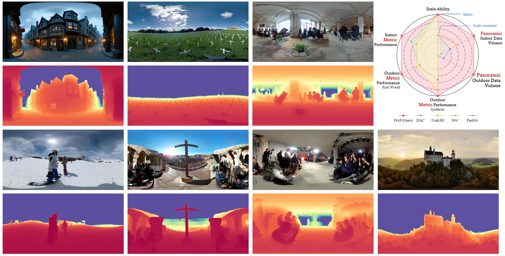

<h1 align="center">
[CVPR 2026] Depth Any Panoramas:<br>
A Foundation Model for Panoramic Depth Estimation
</h1>


<p align="center">
  <a href="https://linxin0.github.io"><b>Xin Lin</b></a> ·
  <a href="#"><b>Meixi Song</b></a> ·
  <a href="#"><b>Dizhe Zhang</b></a> ·
  <a href="#"><b>Wenxuan Lu</b></a> ·
  <a href="https://haodong2000.github.io"><b>Haodong Li</b></a>
  <br>
  <a href="#"><b>Bo Du</b></a> ·
  <a href="#"><b>Ming-Hsuan Yang</b></a> ·
  <a href="#"><b>Truong Nguyen</b></a> ·
  <a href="http://luqi.info"><b>Lu Qi</b></a>
</p>


<p align="center">
  <a href='https://arxiv.org/abs/2512.16913'></a>
  <a href='https://insta360-research-team.github.io/DAP_website/'></a>
  <a href=''></a>
  <a href='https://huggingface.co/spaces/Insta360-Research/DAP'></a>
</p>




## 🔨 Installation

Clone the repo first:

```Bash
git clone https://github.com/Insta360-Research-Team/DAP
cd DAP
```

(Optional) Create a fresh conda env:

```Bash
conda create -n dap python=3.12
conda activate dap
```

Install necessary packages (torch > 2):

```Bash
# pytorch (select correct CUDA version, we test our code on torch==2.7.1 and torchvision==0.22.1)
pip install torch==2.7.1 torchvision==0.22.1

# other dependencies
pip install -r requirements.txt
```

## 🖼️ Dataset

The training dataset will be open soon.


## 🤝 Pre-trained model

Please download the pretrained model: https://huggingface.co/Insta360-Research/DAP-weights


## 📒 Inference

```Bash
python test/infer.py
```


## 🚀 Evaluation


```Bash
python test/eval.py
```


## 🤝 Acknowledgement

We appreciate the open source of the following projects:

* [PanDA](https://caozidong.github.io/PanDA_Depth/)
* [Depth-Anything-V2](https://github.com/DepthAnything/Depth-Anything-V2)


## Citation
```
@article{lin2025dap,
          title={Depth Any Panoramas: A Foundation Model for Panoramic Depth Estimation},
          author={Lin, Xin and Song, Meixi and Zhang, Dizhe and Lu, Wenxuan and Li, Haodong and Du, Bo and Yang, Ming-Hsuan and Nguyen, Truong and Qi, Lu},
          journal={arXiv},
          year={2025}
        }
```
